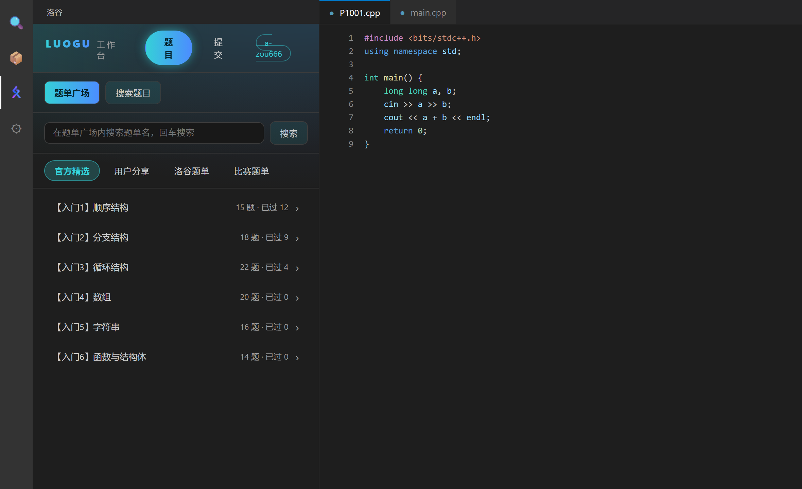
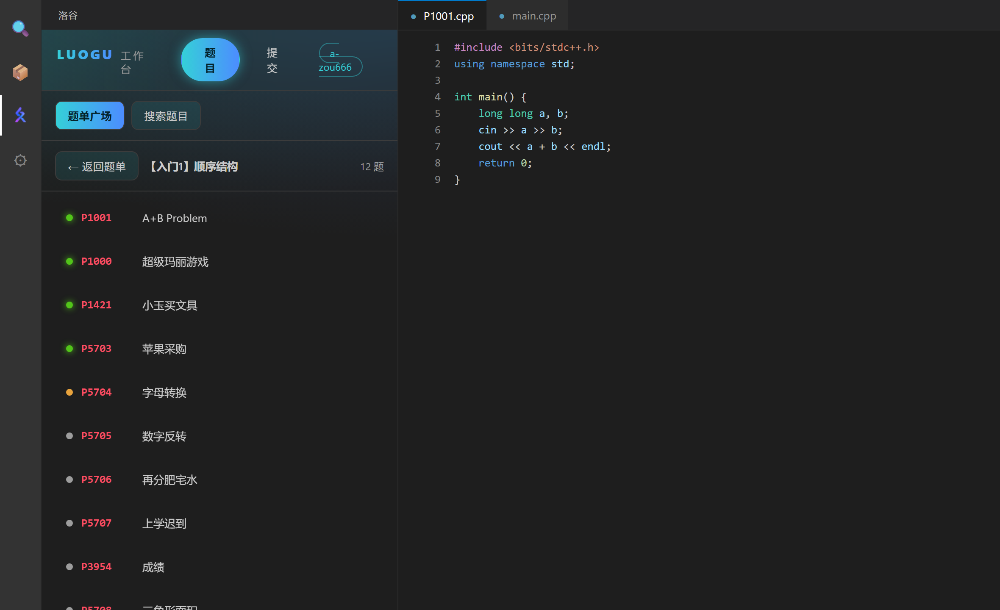
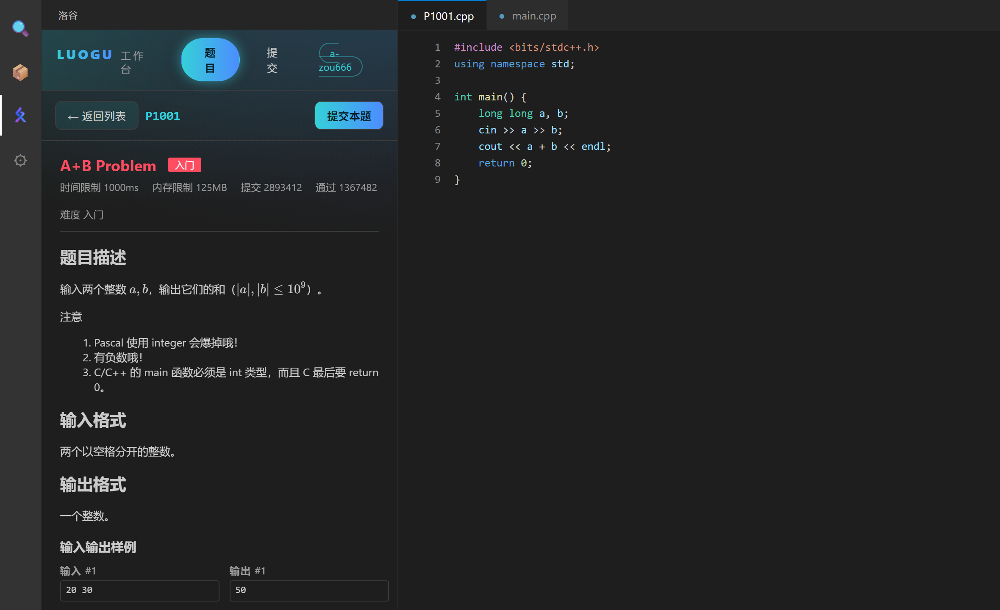
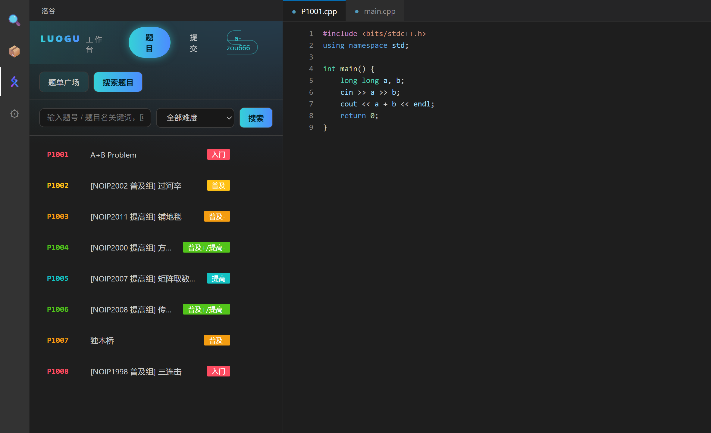
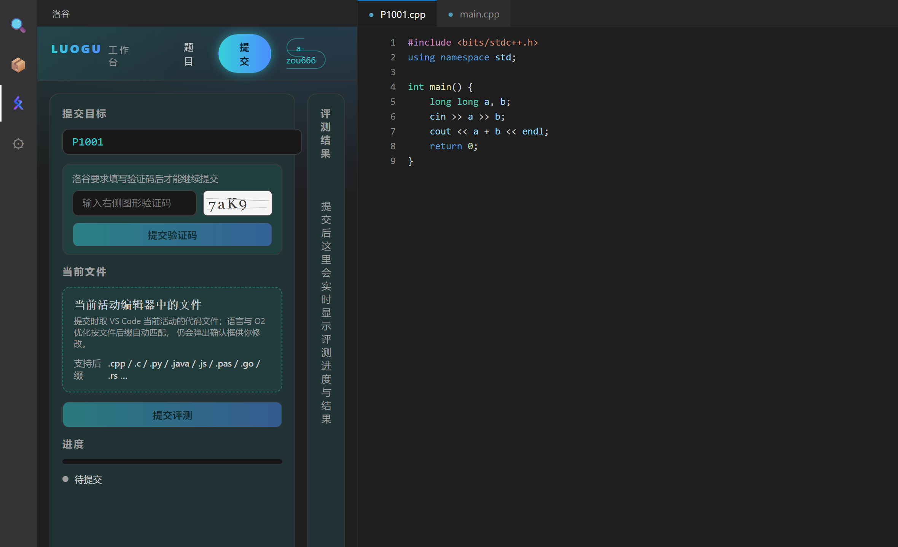
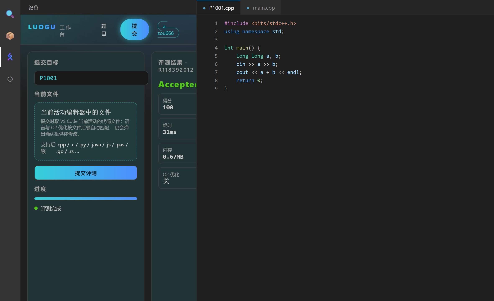
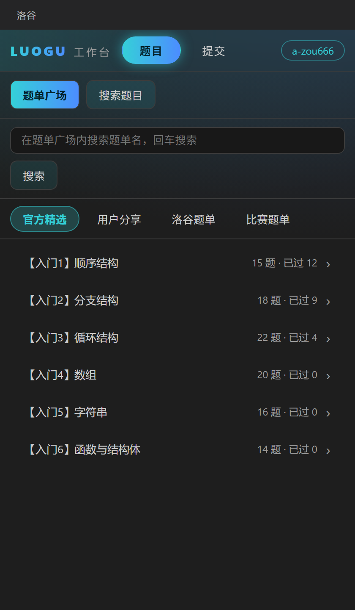
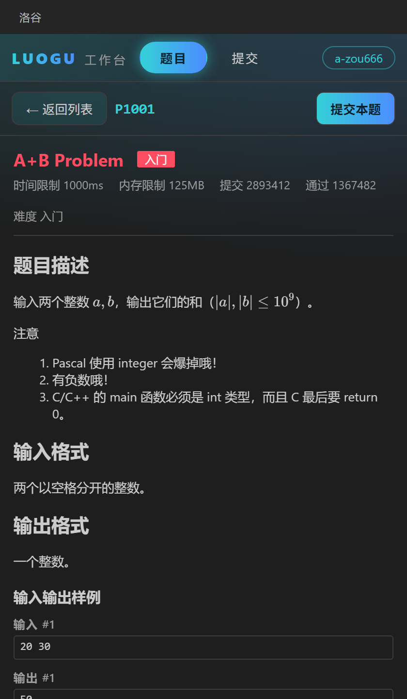

<div align="center">


# vscode-luogu-gui

**在 VS Code 里刷洛谷 —— 一个统一的工作台面板。**

题面内嵌渲染 · 题单逐级下钻 · 验证码按需出现 · 评测结果实时推送

[](https://github.com/a-zou666/vscode-luogu-gui/releases)
[](./LICENSE)
[](https://code.visualstudio.com/)
[](https://github.com/yltx/vscode-luogu)

[界面预览](#界面预览) · [功能](#功能) · [安装](#安装) · [快速上手](#快速上手) · [配置项](#配置项) · [从源码构建](#从源码构建) · [贡献](#贡献)

</div>



---

## 界面预览

| | |
|:--:|:--:|
| <br>**题单广场** —— 频道 → 题单 → 题目逐级下钻，返回时回到来处 | <br>**题面内嵌** —— 洛谷 Markdown 扩展、KaTeX 公式、样例一键复制 |
| <br>**搜索题目** —— 关键词 + 难度筛选 + 分页 | <br>**验证码按需出现** —— 风控时才占版面，平时完全不渲染 |
| <br>**实时评测** —— 提交后进度与结果由扩展主动推送 | <br>**窄面板自适应** —— 侧栏拖到最窄仍然可读、可滚动 |

> 以上截图由 `scripts/doc-shots` 用**真实构建产物**（`dist/webview-workbench.js`）在无头 Chrome 中渲染生成，
> 不是手绘示意图。重新生成：`node scripts/doc-shots/shoot.mjs`。

---

## 功能

### 统一工作台面板

上游把功能摊在一堆树视图里，来回点很费事。本 fork 把入口收敛成一个侧边栏视图（`luogu.workbenchView`），
内嵌 `工作台` webview，用「题目 / 提交」两个页签组织：

- **题目页**
  - 搜索题目：关键词 + 难度筛选 + 分页
  - 题单广场：官方精选 / 用户分享 / 洛谷题单 / 比赛题单，逐级下钻
  - 题目详情**内嵌渲染**，不必另开面板或跳浏览器
  - 支持洛谷新版 Markdown 扩展语法：Tuack 表格、引言块、代码行增强、提示块，以及 KaTeX 数学公式
  - 输入输出样例分栏展示，各自独立复制（不会把「输入/输出」标签行一起复制走）
  - 题面页直接点「提交本题」，带着题号跳到提交页
- **提交页**
  - 明确展示当前提交目标；未指定时取 VS Code 当前活动文件
  - 语言与 O2 优化按文件后缀自动匹配（`.cpp` → C++，以此类推）
  - **验证码按需出现**：服务端只在风控 / 频繁提交时要求，不要求就完全不占版面
  - 提交后实时显示评测进度与结果，评测期间不抢焦点

<div align="center">


<sub>侧栏拖到最窄，题面、公式与样例依然可读 —— 布局按容器宽度自适应</sub>
</div>

### 工程改进

- **两个页签常驻挂载**（只切显隐）：切页签不丢下钻位置与已拉取数据，后台评测进度继续更新
- **登录门控即时响应**：订阅 `authProvider.onDidChangeSessions`，登录 / 登出后门控立即消失，无需重开面板
- **修复监听器泄漏**：提交页监听器正确解绑，不再随每次提交叠加
- **回归门禁**：布局回归测试、生产 bundle 功能核验、发布策略校验（见 [从源码构建](#从源码构建)）

### 沿用上游的完整功能

登录 / 注销 · 查看与搜索题目 · 提交代码 · 查看自己测评 · 最近一次评测（实时进度） · 打卡 ·
题目离线查看 · 查看与发布犇犇 · 查看题解与点赞 / 踩 · 比赛相关 · 按难度与来源随机跳题 ·
我的专栏 · CPH 集成

---

## 安装

### 从 Release 安装（推荐）

1. 到 [Releases](https://github.com/a-zou666/vscode-luogu-gui/releases) 下载最新 `.vsix`
2. 在 VS Code 中按 `Ctrl+Shift+P`，执行 **Extensions: Install from VSIX...**，选中刚下载的文件
3. 侧边栏出现「洛谷」图标，点击展开工作台

命令行安装：

```bash
code --install-extension vscode-luogu-1.0.0.vsix
```

> 需要 VS Code `^1.75.0`。

### 从源码安装

见 [从源码构建](#从源码构建)。

---

## 快速上手

1. **登录**：在工作台点「登录洛谷账号」，或执行命令 `Luogu: 登录洛谷账号(Signin)`。
   登录信息由 VS Code 的 `SecretStorage` 保管，不落盘明文。
2. **找题**：在「题目」页签里搜索关键词，或从「题单广场」按频道逐级下钻。
3. **看题**：点任意题目，题面、限制、样例直接内嵌渲染；样例可一键复制。
4. **写码**：在编辑器里写好代码。
5. **提交**：题面页点「提交本题」，或切到「提交」页签填题号；未填时自动取当前活动文件。
   若服务端要求验证码，验证码输入区会**就地**出现，填完再点一次即可。
6. **看结果**：评测进度与最终结果在提交页实时刷新，无需手动轮询。

---

## 命令

插件注册了 40 条命令，均以 `Luogu:` 分类出现在命令面板中。常用的几条：

| 命令 | 说明 |
|:--|:--|
| `luogu.workbench` | 打开洛谷工作台 |
| `luogu.signin` / `luogu.signout` | 登录 / 登出洛谷账号 |
| `luogu.searchProblem` | 搜索题目 |
| `luogu.traininglist` / `luogu.traindetails` | 题单广场 / 题单详情 |
| `luogu.submitCurrentFile` | 提交当前文件 |
| `luogu.lastRecord` | 查看最近一次评测 |
| `luogu.fate` | 打卡 |
| `luogu.benben` | 犇犇 |
| `luogu.random` | 按难度与来源随机跳题 |
| `luogu.jumpToCph` | 在 CPH 中打开当前题目 |

完整列表可在 VS Code 命令面板输入 `Luogu:` 查看。

---

## 配置项

在「设置」中搜索 `luogu` 即可配置：

| 配置项 | 类型 | 默认值 | 说明 |
|:--|:--|:--|:--|
| `luogu.defaultLanguageVersion` | object | — | 提交时使用的默认语言版本 |
| `luogu.alwaysUseDefaultLanguageVersion` | boolean | `true` | 按后缀自动识别语言并沿用默认 O2 设置，不再弹窗询问 |
| `luogu.guessProblemID` | boolean | `false` | 尝试通过 CPH 配置或文件名猜测题号，不再提示输入 |
| `luogu.defaultProblemSet` | string | — | 随机跳题的默认题库 |
| `luogu.defaultDifficulty` | string | — | 随机跳题的默认难度 |
| `luogu.showSelectProblemsetHint` | boolean | `true` | 随机跳题时显示题库选择提示 |
| `luogu.showSelectDifficultyHint` | boolean | `true` | 随机跳题时显示难度选择提示 |
| `luogu.showRecordPanel` | boolean | `true` | 打开评测记录时显示 webview 面板 |
| `luogu.maxHistoryLength` | integer | `256` | 最近浏览记录上限 |
| `luogu.webviewViewColumn` | string | `"Beside"` | webview 面板打开位置（`Beside` / `Active` / `One` / `Two` / `Three`） |
| `luogu.cphStyle` | string | `"ProblemID"` | 传送到 CPH 时的文件名形式 |
| `luogu.cphPort` | integer | `27121` | 传送到 CPH 使用的本地端口 |

---

## 从源码构建

**环境要求**：Node.js ≥ 18、VS Code `^1.75.0`。

```bash
git clone git@github.com:a-zou666/vscode-luogu-gui.git
cd vscode-luogu-gui

npm install
git submodule init && git submodule update   # luogu-api-docs，提供洛谷 API 类型定义
npm run compile                              # 或在 VS Code 内按 F5 启动调试
```

### 打包

```bash
npm run package      # webpack 生产构建 → dist/
npm run pack:local   # 构建 + bundle 功能核验 + 打包成 .vsix
npm run pack:watch   # 源码一变自动重打包，避免拿到旧 .vsix 去实测
```

### 测试与门禁

```bash
npm run lint          # ESLint
npm run typecheck     # tsc --noEmit
npm run test          # vitest 单元测试
npm run test:release  # 发布策略校验（版本一致性、stable 规则）
npm run test:layout   # 提交框布局回归（窄面板宽度、验证码按需渲染、单行输入高度）
npm run ci            # 以上全部
```

### 文档截图

`docs/images` 下的截图由脚本从**真实构建产物**渲染生成，不是手绘：

```bash
node scripts/doc-shots/shoot.mjs          # 生成全部截图
node scripts/doc-shots/verify-scenes.mjs  # 回归门禁：场景文本断言 + 截图哈希去重
```

`verify-scenes.mjs` 会断言每个场景渲染出的 DOM 里含有关键词，并要求所有截图哈希两两不同 ——
后者专门用来拦住「两个场景渲染成同一张图」这类静默失败。

---

## 贡献

- 本 fork 的问题请提到 [a-zou666/vscode-luogu-gui/issues](https://github.com/a-zou666/vscode-luogu-gui/issues)。
- 与上游共有的功能问题，建议同时关注[上游仓库](https://github.com/yltx/vscode-luogu)。
- 提交前请跑通 `npm run ci`。详细流程见 [CONTRIBUTING.md](./CONTRIBUTING.md)。
- 变更记录见 [CHANGELOG.md](./CHANGELOG.md)。

---

## 致谢

本项目的绝大部分工作来自上游作者与贡献者，本 fork 只是在其基础上重做了界面层：

- [@yltx](https://github.com/yltx)（引领天下）—— 上游仓库作者与长期维护者
- 上游贡献者：Himself65、YanWQmonad、FangZeLi、andyli、蒟蒻水儿、[宝硕](https://baoshuo.ren)、品小呈、MrPython、Enigma_Soul
- [0f-0b/luogu-api-docs](https://github.com/0f-0b/luogu-api-docs) —— 洛谷 API 文档与类型定义（以 submodule 引入）

## 声明

- Luogu 图标来自 [洛谷](https://www.luogu.com.cn/)，严禁商业使用。
- UI 图标来自 [Icons8](https://icons8.cn/) 与 [FontAwesome](https://fontawesome.com/)。
- 上游用户交流群：1141066631

## License

[MIT](./LICENSE) © yltx 及贡献者